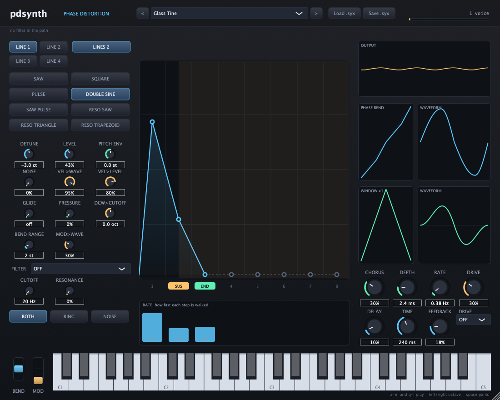

# pdsynth

Casio CZ phase distortion, in software. CLAP, VST3, AU, LV2 and standalone.



Phase distortion is not FM and it is not subtractive, though it was sold in
1984 against machines that were both. A CZ reads one sine table and bends the
phase on the way in. The phase of a plain oscillator climbs from 0 to 1 at a
constant rate; bend that climb so it rushes through part of the cycle and
crawls through the rest, and the sine that comes out has harmonics. How far it
is bent is a single number, and on the hardware that number comes from an eight
step envelope, which is why a CZ sweeps the way it does while owning no filter
at all.

That is why the eight step envelope is the middle of the window rather than
something behind a menu, and why the phase bend is drawn live beside the
waveform it produces. It is a technique nobody believes from a description.

## Building

```
cmake -B build && cmake --build build
```

Fetches JUCE 8 and clap-juce-extensions and produces the standalone, the CLAP,
the VST3, the AU on macOS and the LV2. The synthesis is plain C and has no
dependencies at all: `-DPDSYNTH_BUILD_PLUGIN=OFF` builds the engine, the tests
and the headless renderer on their own.

## Playing it

The standalone publishes a MIDI port called **pdsynth**, so a DAW, a keyboard
or a script can reach it without opening a settings dialog. The computer keys
play two octaves, `z` to `m` and `q` to `i`, with the arrows shifting octave and
space for panic. Bend and mod wheels sit at the left of the keyboard; bend
springs back to center when released, as a real one does.

## What is in it

**Eight waveforms**, the set a CZ-101 lists on its panel.

| | |
|---|---|
| saw, square, pulse, double sine, saw pulse | a bent phase, one sine table |
| reso saw, reso triangle, reso trapezoid | a sine at a multiple of the note, under a falling window |

Each is checked by its spectrum rather than by eye. Every one collapses to a
clean sine when the DCW is at zero, which is what the hardware does; the
sawtooth carries a falling harmonic series; the square carries odd harmonics
and no even ones; and the resonant three sweep a formant from the third
harmonic to the thirteenth while the pitch stays where it is.

**Eight step envelopes**, three per line, on pitch, waveform and level. Each
step is a rate and a level, with one marked as the sustain and one as the end.
This is not an ADSR with extra stages: it can do an ADSR, and it can also do a
double attack, a swell that pauses, or a decay that stops halfway down and
starts again. The envelope on the waveform is why no filter is needed.

**Up to four lines per voice**, each an oscillator under its own three
envelopes, detunable against each other and placed across the stereo field. The
hardware stacked two; the limit there was the cost of the chips, and four is the
same code run twice more. They are independent rather than paired, because a
pair is four lines with two of the detunes set the same and the reverse is not
true.

**Glide, aftertouch, and a multimode filter**, none of which the hardware had.
The filter is a state variable design giving low pass, high pass, band pass and
notch, and its cutoff can follow the first line's waveform envelope, so a filter
sweep and a phase bend can move together. It is off unless a patch asks for it
and no preset uses it: the argument that a CZ does not need a filter is sound,
and this does not weaken it. It is here because a bend can only ever add
harmonics, and there is no other way to notch something out or make a band pass
honk.

**Ring and noise modulation.** The originals had both; the 2026 hardware
reissue has neither. Noise here shakes how far the phase is bent rather than
how loud the line is: shaking the amplitude is ring modulation with a noise
source, and at full depth it removes most of the note.

**Chorus, delay and drive.** The hardware reissue has a chorus, and a synth
that arrives completely dry sounds thinner than the box standing next to it,
whatever its oscillators are doing. The chorus is three taps of the same slow
cycle with the sides moved apart; the delay's repeats darken as they go,
because a repeat that keeps all its top end stops sounding like distance and
starts sounding like a second instrument; and the drive offers a soft knee, a
hard clip and a fold. All written here rather than borrowed: a chorus is a
delay that wobbles and the suites worth reading for approach are GPL, which
would follow the code home.

**Twenty presets**, original designs built from published technique. No
parameter list is copied from anyone and Casio's ROM data is not here.

**A librarian.** It reads and writes Casio CZ voice dumps, the CZ-101/1000/5000
shape that every CZ can read, so patches made on the hardware open here and
patches made here can be sent back. Two buttons beside the bank.

The rule it follows is that a translation never fails silently. pdsynth has
four lines where a CZ has two, a filter the hardware never had, and it hears
velocity and pressure that a CZ-101 cannot. So every load and every save comes
back with a written account of what could not make the trip, naming the control
each time and saying what will happen on the machine. It does not refuse and it
does not quietly round.

It also keeps what it does not understand. A voice loaded and saved again is
byte for byte the file that arrived, including the vibrato section, the key
follow, the CZ's pairing of two waveforms on a line, and the per step falling
bit, which real dumps show is stored rather than worked out from the levels. A
librarian that rewrites bytes it does not model corrupts a collection quietly,
one save at a time.

## Testing

```
ctest --test-dir build
```

Ten suites. The oscillator is judged by its spectrum, because that is the only
thing about an oscillator a listener can hear. The envelope is judged by where
it is at a given moment, because one that reaches the right levels at the wrong
time is a different instrument. The voice is judged on pitch, detuning,
velocity, and on whether the waveform envelope does the work a filter would do
elsewhere.

The last two suites judge the bank. One asks whether a preset is broken: does
it sound, does it answer the hand, does it sit at the level of its neighbours.
The other asks the harder question, whether a preset behaves like the thing it
is named after, because a marimba that sustains for four seconds is not a
marimba however clean it measures. Those targets come from how the instruments
work rather than from taste: a struck bar rings and then stops and dulls as it
goes, brass brightens after the note starts rather than before, an organ is a
switch and not a shape. It found eleven real faults the first time it ran.

The librarian is checked twice over, because there are two ways for it to be
wrong. `pd_sysexcheck` takes real CZ dumps through the C translator and reports
how much of each one survived, by section. `pd_syxplugcheck` takes the same
dumps out to the plugin's parameters and back, which is the trip a player's
patch actually makes and which the C tests cannot see: parameters are floats
with ranges, and a rate of 73 coming back as 72 would quietly alter every patch
anybody saved. That second check is why the detune, the end step and the sign
of a zero detune were fixed. Both run on every push.

The suites are also checked by breaking the code on purpose and seeing whether
they notice. That is how the sysex tests grew: six deliberate faults went
straight through the first run, all of them changes applied to both the encoder
and the decoder, which a round trip cannot see by construction.

## Still to come

CV and gate are in and checked on every push, but the last mile needs a DC
coupled interface before the voltages mean anything outside a test.

And the honest one: none of the librarian has ever touched a real CZ. It is
verified against twenty real patch files, which is not the same as a machine.
If you own a CZ, or the recent hardware reissue, a dump out of it and a write
back into it would be worth more than everything above.

## Thanks

To [@Reaper10](https://github.com/Reaper10), whose description of what a
software CZ ought to be is why this exists, and whose list is most of what is
left to build.

## License

GPL-2.0-or-later. See [COPYING](COPYING).
