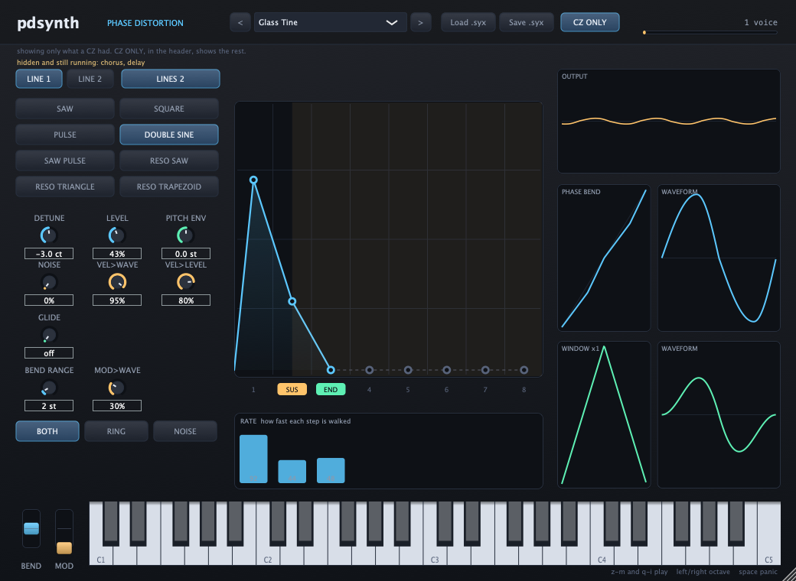

# pdsynth

**Casio CZ phase distortion, in software, plus a few things the hardware never could.**
A free synthesizer for macOS, Windows and Linux. VST3, CLAP, AU, LV2 and standalone.

[](https://github.com/keithadler/pdsynth/actions/workflows/build.yml)
[](COPYING)


### [Download the latest release](https://github.com/keithadler/pdsynth/releases/latest)

Free, GPL, no account, nothing phones home. 27 sounds built in, and it reads and
writes real Casio CZ patch files.

---

## Get playing in a minute

1. **[Download](https://github.com/keithadler/pdsynth/releases/latest)** the file for your system.
2. **Just want to try it?** Open the standalone app. Press `z` to `m` and `q` to `i` on your
   computer keyboard to play. Pick a sound from the box at the top. Arrow keys shift the
   octave, space stops everything.
3. **Using it in a DAW?** Copy the plugin for your host into its folder, rescan, and load it.

| | VST3 | CLAP | AU | LV2 |
|---|---|---|---|---|
| **macOS** | `~/Library/Audio/Plug-Ins/VST3` | `~/Library/Audio/Plug-Ins/CLAP` | `~/Library/Audio/Plug-Ins/Components` | |
| **Windows** | `C:\Program Files\Common Files\VST3` | `C:\Program Files\Common Files\CLAP` | | |
| **Linux** | `~/.vst3` | `~/.clap` | | `~/.lv2` |

The standalone also publishes a MIDI port called **pdsynth**, so a keyboard, a DAW or a
script can play it without a settings dialog.

> **macOS:** these builds are not signed or notarized. If macOS says it cannot verify an app
> or plugin, run `xattr -dr com.apple.quarantine <the file>` once, or right-click it and choose Open.

---

## The sounds

Twenty-seven presets, all original designs. Each is checked against how the real
instrument behaves, not just against "sounds fine": a marimba has to ring and then stop, brass
has to brighten after the note starts, a hurdy-gurdy has to rattle.

| | |
|---|---|
| **Keys** | Glass Tine (a glass electric piano), Harpsi, Synth Clav |
| **Bass** | Rubber Bass, Fretless |
| **Strings and brass** | Digi Strings, Pizzicato, Brass Stab, Brass Swell |
| **Wind and lead** | Air Flute, Reed Pipe, Sweep Lead, Formant Sweep |
| **Bells and mallets** | Bell Pad, Tubular, Marimba, Steel Drum, Vibe Bar |
| **Voices** | Choir Ah (a pad), **Vowel Choir** (a real, fixed vowel) |
| **Odd and wonderful** | **Waterphone**, **Hurdy Gurdy**, **Glass Harmonica**, Drawbar |
| **Granular** | Grain Pad, Grain Shimmer, Grain Dust |

A few are worth hearing first:

- **Hurdy Gurdy** is three instruments in one: a bowed melody string, a drone an octave
  under, and the chien, the loose bridge that rattles. A rattle has no pitch, so a phase
  distortion oscillator cannot make one. A grain cloud can.
- **Vowel Choir** sings an actual vowel. A vowel is a resonance that stays put while the note
  moves, and a keyboard-tracking filter turns it into a wah. This one holds still.
- **Glass Harmonica** is two bowls rubbed a few cents apart with a quiet second mode that sits
  off the harmonic series, the way a real glass shell's does.
- **Waterphone** has partials that are not harmonics at all, which nothing a bent sine does
  on its own can fake.

---

## What phase distortion is

A CZ reads one sine table and bends the phase on the way in. The phase of a plain oscillator
climbs from 0 to 1 at a constant rate. Bend that climb so it rushes through part of the cycle
and crawls through the rest, and the sine that comes out has harmonics. How far it is bent is
a single number, and on the hardware that number comes from an eight step envelope. That is
why a CZ sweeps the way it does while owning no filter at all.

It is not FM and it is not subtractive, though it was sold in 1984 against machines that
were both. It is a technique nobody believes from a description, so the eight step envelope
is the middle of the window and the phase bend is drawn live beside the waveform it makes.

## What is in it

**Eight waveforms**, the set a CZ-101 lists on its panel. Five are one sine table under a
different bend. The resonant three are a sine at a multiple of the note under a falling
window, which sweeps a formant while the pitch stays where it is.

**Eight step envelopes**, three per line, on pitch, waveform and level. Each step is a rate
and a level, with one marked as sustain and one as the end. It can do an ADSR, and it can
also do a double attack, a swell that pauses, or a decay that stops halfway down and starts
again.

**Up to four lines per voice**, each its own oscillator under its own three envelopes,
detunable against each other and spread across the stereo field. The hardware stacked two.

**Ring and noise modulation**, which the originals had and the 2026 reissue dropped.

**Chorus, delay and drive.** The delay's repeats darken as they go, because a repeat that
keeps all its top end stops sounding like distance. Drive offers a soft knee, a hard clip
and a fold.

**A filter, glide and aftertouch**, none of which a CZ had. The filter is a state variable
design (low, high, band pass, notch) and it is off unless a patch asks for it.

### Things a CZ could not do

**Granular.** Any line can be a grain cloud instead of a plain oscillator. The grains are cut
from the same phase distorted sine the rest of the synth makes, at the same bend, so a cloud
still opens as you play harder and still follows its waveform envelope. Each line has its own
cloud.

| | |
|---|---|
| **LENGTH** | one grain, 1 to 500 ms |
| **OVERLAP** | how many sound at once |
| **SHAPE**, **EDGE** | the window on each grain, and how sharply it opens |
| **SCATTER** | jitter in when grains start |
| **DETUNE** | how far apart their pitches are pulled |

Length and overlap are really one control: the grain train repeats at overlap divided by
length, and you hear that rate as a pair of sidebands either side of the note. Long grains
deep in overlap make a texture. Short grains at an overlap below one make the note stop being
a note. Grain Pad, Grain Shimmer and Grain Dust are those three places.

**CZ ONLY.** A CZ is two lines, three envelopes each, ring and noise modulation, a bend wheel
and portamento. If you came here for a CZ, one button in the header hides everything the
hardware never had.



It is a view, not a mode. Nothing is switched off and no sound changes, so if something hidden is
still running the panel says so: *hidden and still running: chorus, delay*.

---

## Casio patch files

pdsynth reads and writes Casio CZ voice dumps (`.syx`), the CZ-101/1000/5000 format that every CZ
can read. Two buttons in the header, **Load .syx** and **Save .syx**.

A translation never fails silently. pdsynth has four lines where a CZ has two, a filter the
hardware never had, and it hears velocity a CZ-101 cannot. So every load and every save comes
back with a written list of what could not make the trip, naming the control each time. It
does not refuse and it does not quietly round.

It also keeps what it does not understand. **A voice loaded and saved again is byte for byte the
file that arrived**, including the parts pdsynth has no controls for. A librarian that rewrites
bytes it does not model corrupts a collection quietly, one save at a time.

### The factory sounds as a bank

The 27 presets are already exported as Casio dumps in [`banks/`](banks/): two files of sixteen
and eleven voices, plus a slot list. Copy them to a flash drive beside your CZ banks and send
them with any MIDI utility. **You do not need to build anything.**

Twelve of the 27 lean on something a CZ does not have, such as grains or a third line. The slot
list marks those "approximate on a real CZ" and names what is missing. To regenerate the files:

```
pd_exportbank <directory> [midi channel]
```

---

## Build it yourself

```
cmake -B build && cmake --build build
```

Fetches JUCE 8 and clap-juce-extensions and produces the standalone, CLAP, VST3, AU (macOS) and
LV2. The synthesis is plain C with no dependencies: `-DPDSYNTH_BUILD_PLUGIN=OFF` builds just the
engine, the tests and the headless renderer.

```
ctest --test-dir build
```

<details>
<summary><b>How it is tested</b> (13 suites, and why you can believe them)</summary>

<br>

The oscillator is judged by its spectrum, because that is the only thing about an oscillator a
listener can hear. The envelope is judged by where it is at a given moment. The voice is judged
on pitch, detuning and velocity.

Two suites judge the bank. One asks whether a preset is broken: does it sound, does it answer
the hand, does it sit at the level of its neighbors, does it survive having its filter switched
on. The other asks whether a preset behaves like the thing it is named after. Those targets come
from how the instruments work rather than from taste: a struck bar rings and then stops, brass
brightens after the note starts, a formant stays put while the pitch moves, two bowls shimmer
instead of pulsing.

The librarian is checked twice, once through the C translator and once out to the plugin's
parameters and back, which is the trip a player's patch actually makes. Parameters are floats with
ranges, and a rate of 73 coming back as 72 would quietly alter every patch anybody saved.

The grain cloud cannot be judged like the oscillator. Scattering a tone smears its spectrum on
purpose, so the tests ask a player's questions instead: is it still the note, does it stay that note
when the spread opens, does the level hold when the density changes, does it click.

The suites are also checked by breaking the code on purpose and seeing whether they notice. That is
how several tests were found to be passing while checking nothing.

```
tools/same-sound.sh v0.3.0
```

answers a question no suite can: did this change move a single sample. It renders the demo at an
earlier commit and at the working tree and compares the bytes.

</details>

## Still to come

Every claim about the librarian is verified against twenty real CZ patch files, and **none of it has
ever touched a real CZ.** If you own a CZ, or the recent hardware reissue, a dump out of it and a
write back into it would be worth more than everything above. CV and gate are in and checked on every
push, but the last mile needs a DC coupled interface before the voltages mean anything.

## Thanks

To [Sean Bolton](https://github.com/smbolton), whose asynchronous granular oscillator in
ZedSynth (formerly WhySynth) the grain scheduler and its five window shapes are ported from, with his
blessing; and through him to **Mats Olsson**, whose MSS the window shapes came from before that. Both
notices are kept at the top of `src/pd_grain.c`. One thing changed on the way across: their per-grain
detune is drawn from an asymmetric range, so opening the spread also raised the pitch. Here it is
symmetric, in cents, and a test holds it centered.

To [@Reaper10](https://github.com/Reaper10), whose describing of what a software CZ ought to be is why
this exists, and who kept going. What he actually caused:

| | |
|---|---|
| a post about the CZ | the reason this was started |
| a video about the CZ-1 Mini | pointed at the voice dump layout, which is the whole librarian |
| "I can't see the title bar" | the window opening bigger than the screen, fixed |
| "where is the filter?", with a screenshot | a status line that read as "this synth has no filter", reworded |
| "could it do a waterphone?" | the Waterphone preset, and the measurement that decides whether it is one |
| asking where the bend range was | bend range and mod depth given controls, invisible since the first release |
| asking for a granular synth | the grain cloud on every line, and three presets for it |
| asking for a hurdy-gurdy, a choir, a glass harmonica | three presets, and two bugs found while building them |
| asking for the factory bank as a file | `banks/`, and the exporter |

Most of those are not feature requests. They are somebody using the thing and saying what was wrong
with it, which is the part that cannot be done alone.

## What helps

Bug reports, ideally with a screenshot. Dumps off real hardware. Documented formats: what the bytes
mean, from a manual or an open source tool that already reads them.

**Not ROM images or firmware.** Those are the manufacturer's copyrighted code and cannot be accepted
here, in an issue or anywhere else. It is the same rule that means this contains no Casio data.

## License

GPL-2.0-or-later. See [COPYING](COPYING).
