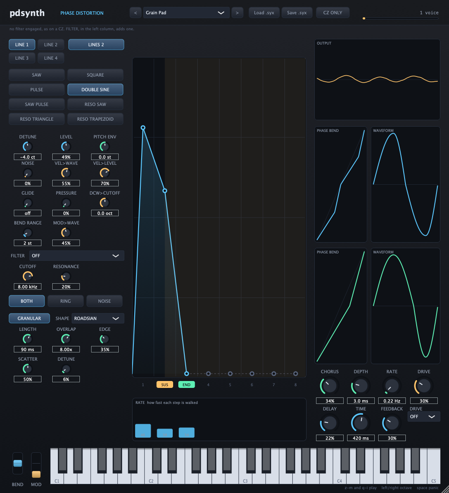

# pdsynth

Casio CZ phase distortion, in software. CLAP, VST3, AU, LV2 and standalone.



Phase distortion is not FM and it is not subtractive, though it was sold in
1984 against machines that were both. A CZ reads one sine table and bends the
phase on the way in. The phase of a plain oscillator climbs from 0 to 1 at a
constant rate; bend that climb so it rushes through part of the cycle and
crawls through the rest, and the sine that comes out has harmonics. How far it
is bent is a single number, and on the hardware that number comes from an eight
step envelope, which is why a CZ sweeps the way it does while owning no filter
at all.

That is why the eight step envelope is the middle of the window rather than
something behind a menu, and why the phase bend is drawn live beside the
waveform it produces. It is a technique nobody believes from a description.

## Building

```
cmake -B build && cmake --build build
```

Fetches JUCE 8 and clap-juce-extensions and produces the standalone, the CLAP,
the VST3, the AU on macOS and the LV2. The synthesis is plain C and has no
dependencies at all: `-DPDSYNTH_BUILD_PLUGIN=OFF` builds the engine, the tests
and the headless renderer on their own.

## Playing it

The standalone publishes a MIDI port called **pdsynth**, so a DAW, a keyboard
or a script can reach it without opening a settings dialog. The computer keys
play two octaves, `z` to `m` and `q` to `i`, with the arrows shifting octave and
space for panic. Bend and mod wheels sit at the left of the keyboard; bend
springs back to center when released, as a real one does.

## What is in it

**Eight waveforms**, the set a CZ-101 lists on its panel.

| | |
|---|---|
| saw, square, pulse, double sine, saw pulse | a bent phase, one sine table |
| reso saw, reso triangle, reso trapezoid | a sine at a multiple of the note, under a falling window |

Each is checked by its spectrum rather than by eye. Every one collapses to a
clean sine when the DCW is at zero, which is what the hardware does; the
sawtooth carries a falling harmonic series; the square carries odd harmonics
and no even ones; and the resonant three sweep a formant from the third
harmonic to the thirteenth while the pitch stays where it is.

**Eight step envelopes**, three per line, on pitch, waveform and level. Each
step is a rate and a level, with one marked as the sustain and one as the end.
This is not an ADSR with extra stages: it can do an ADSR, and it can also do a
double attack, a swell that pauses, or a decay that stops halfway down and
starts again. The envelope on the waveform is why no filter is needed.

**Up to four lines per voice**, each an oscillator under its own three
envelopes, detunable against each other and placed across the stereo field. The
hardware stacked two; the limit there was the cost of the chips, and four is the
same code run twice more. They are independent rather than paired, because a
pair is four lines with two of the detunes set the same and the reverse is not
true.

**Glide, aftertouch, and a multimode filter**, none of which the hardware had.
The filter is a state variable design giving low pass, high pass, band pass and
notch, and its cutoff can follow the first line's waveform envelope, so a filter
sweep and a phase bend can move together. It is off unless a patch asks for it
and no preset uses it: the argument that a CZ does not need a filter is sound,
and this does not weaken it. It is here because a bend can only ever add
harmonics, and there is no other way to notch something out or make a band pass
honk.

**Ring and noise modulation.** The originals had both; the 2026 hardware
reissue has neither. Noise here shakes how far the phase is bent rather than
how loud the line is: shaking the amplitude is ring modulation with a noise
source, and at full depth it removes most of the note.

**Chorus, delay and drive.** The hardware reissue has a chorus, and a synth
that arrives completely dry sounds thinner than the box standing next to it,
whatever its oscillators are doing. The chorus is three taps of the same slow
cycle with the sides moved apart; the delay's repeats darken as they go,
because a repeat that keeps all its top end stops sounding like distance and
starts sounding like a second instrument; and the drive offers a soft knee, a
hard clip and a fold. All written here rather than borrowed: a chorus is a
delay that wobbles and the suites worth reading for approach are GPL, which
would follow the code home.

**Twenty presets**, original designs built from published technique. No
parameter list is copied from anyone and Casio's ROM data is not here.

**A librarian.** It reads and writes Casio CZ voice dumps, the CZ-101/1000/5000
shape that every CZ can read, so patches made on the hardware open here and
patches made here can be sent back. Two buttons beside the bank.

The rule it follows is that a translation never fails silently. pdsynth has
four lines where a CZ has two, a filter the hardware never had, and it hears
velocity and pressure that a CZ-101 cannot. So every load and every save comes
back with a written account of what could not make the trip, naming the control
each time and saying what will happen on the machine. It does not refuse and it
does not quietly round.

It also keeps what it does not understand. A voice loaded and saved again is
byte for byte the file that arrived, including the vibrato section, the key
follow, the CZ's pairing of two waveforms on a line, and the per step falling
bit, which real dumps show is stored rather than worked out from the levels. A
librarian that rewrites bytes it does not model corrupts a collection quietly,
one save at a time.

## Testing

```
ctest --test-dir build
```

Twelve suites. The oscillator is judged by its spectrum, because that is the only
thing about an oscillator a listener can hear. The envelope is judged by where
it is at a given moment, because one that reaches the right levels at the wrong
time is a different instrument. The voice is judged on pitch, detuning,
velocity, and on whether the waveform envelope does the work a filter would do
elsewhere.

The last two suites judge the bank. One asks whether a preset is broken: does
it sound, does it answer the hand, does it sit at the level of its neighbours.
The other asks the harder question, whether a preset behaves like the thing it
is named after, because a marimba that sustains for four seconds is not a
marimba however clean it measures. Those targets come from how the instruments
work rather than from taste: a struck bar rings and then stops and dulls as it
goes, brass brightens after the note starts rather than before, an organ is a
switch and not a shape. It found eleven real faults the first time it ran.

The librarian is checked twice over, because there are two ways for it to be
wrong. `pd_sysexcheck` takes real CZ dumps through the C translator and reports
how much of each one survived, by section. `pd_syxplugcheck` takes the same
dumps out to the plugin's parameters and back, which is the trip a player's
patch actually makes and which the C tests cannot see: parameters are floats
with ranges, and a rate of 73 coming back as 72 would quietly alter every patch
anybody saved. That second check is why the detune, the end step and the sign
of a zero detune were fixed. Both run on every push.

The grain cloud cannot be judged that way at all. Scattering a tone into
windowed fragments smears its spectrum on purpose, so the off harmonic energy
that condemns the oscillator is the effect working. `test_grain` asks a
player's questions instead: is it still the note, does it stay that note when
the spread opens, does the level hold when the density changes, does it click,
does the window do anything, and does switching it off leave the synth exactly
as it was. `pd_grainplugcheck` then does the same trip the librarian gets, out
to the plugin's parameters and back, because a switch written to the parameters
and never read back would leave every engine test passing and the control dead.

The suites are also checked by breaking the code on purpose and seeing whether
they notice. That is how the sysex tests grew: six deliberate faults went
straight through the first run, all of them changes applied to both the encoder
and the decoder, which a round trip cannot see by construction. The grain tests
were built the same way and thirteen faults were put through them, including
restoring the uncentered detune from the code they came from, hardcoding the
grain length, and making the pitch spread do nothing. The last two passed at
first: both tests only asked whether the cloud stayed centered, which is
something a control that does nothing passes perfectly.

```
tools/same-sound.sh v0.3.0
```

Answers a question the suites cannot: did this change move a single sample.
Every threshold in every suite is above some size, and a drift of one part in
ten million through the oscillator passes all twelve of them, which was
measured rather than assumed. This renders the demo at an earlier commit and at
the working tree and compares the bytes. It compares the machine against
itself, never against a stored hash, because different compilers round
differently and that is not a regression. All of the granular work above leaves
it identical, which is what "off is off" has to mean.

## Still to come

CV and gate are in and checked on every push, but the last mile needs a DC
coupled interface before the voltages mean anything outside a test.

And the honest one: none of the librarian has ever touched a real CZ. It is
verified against twenty real patch files, which is not the same as a machine.
If you own a CZ, or the recent hardware reissue, a dump out of it and a write
back into it would be worth more than everything above.

## CZ ONLY

A CZ-101 is two lines, three eight step envelopes each, ring and noise
modulation, a bend wheel and portamento. pdsynth adds a filter, a grain cloud,
two more lines, aftertouch and a rack of effects, and somebody who came here for
a CZ has to work out which half of the panel is the instrument.

**CZ ONLY**, in the header, hides everything the hardware never had.

It is a view and not a mode. Nothing is switched off and no sound changes, so
anything hidden that is still running says so on screen rather than becoming
invisible and inexplicable: load a preset with chorus on, switch the view, and
the line under the header reads *hidden and still running: chorus*. The
preference travels in the saved session.

This is Reaper10's objection and his suggestion was to split the extra parts
into a separate plugin. That would cost anyone who wants both, and it would not
help anyone who wants the extras, so the panel hides them instead.

## Granular

Two lines of phase distortion is a CZ. Twenty overlapping grains of it is not,
and could never have been: the hardware had one phase accumulator per line.

Any line can be switched to a grain cloud instead of a plain oscillator. The
grains are cut from the same phase distorted sine the rest of the synth makes,
at the same bend, so a cloud still opens as it is played and still follows its
DCW envelope. That is the part a sampler's granular cannot do.

| | |
|---|---|
| **LENGTH** | one grain, 1 to 500 ms |
| **OVERLAP** | how many sound at once |
| **SHAPE**, **EDGE** | the window on each grain, and how sharply it opens |
| **SCATTER** | jitter in when grains start |
| **DETUNE** | how far apart their pitches are pulled |

Length and overlap are the two that matter, and they are one control between
them: the grain train repeats at overlap divided by length, and that rate is
audible as a pair of sidebands either side of the note. Long grains deep in
overlap put those sidebands close in and quiet, which is a texture. Short
grains at an overlap below one put them far out and loud, and the note stops
being a note. Grain Pad, Grain Shimmer and Grain Dust in the bank are those
three places.

Each line has its own cloud, so one line can scatter while another plays
straight. **Hurdy Gurdy** in the bank is why that matters: its melody string and
its drone are plain oscillators and its chien, the loose bridge that rattles, is
a grain cloud, because a rattle has no pitch and nothing in a phase distortion
oscillator can make one.

A CZ voice dump has no byte for any of this, so saving a granular patch as .syx
says so in the report rather than losing it quietly.

## Thanks

To [Sean Bolton](https://github.com/smbolton), whose asynchronous granular
oscillator in ZedSynth (formerly WhySynth) the grain scheduler and its five
window shapes are ported from, and who gave his blessing for it; and through
him to **Mats Olsson**, whose MSS the window shapes came from before that. Both
notices are kept at the top of `src/pd_grain.c`, where they belong. Their code
is GPL and so is this, which is the arrangement working as intended rather than
a favour anyone had to do.

One thing changed on the way across, and it is worth naming rather than
burying: their per grain detune is drawn from an asymmetric range, so opening
the spread also raises the pitch. Their source carries a `-FIX- does not center
on frequency` note about it. Here the draw is symmetric and the detune is in
cents, and `test_grain` measures the cloud's center against the note to hold it
that way. Putting their version back makes that test read 176 cents sharp.

To [@Reaper10](https://github.com/Reaper10). Describing what a software CZ
ought to be is why this exists at all, and it did not stop there. Naming what
he actually caused is more use than thanking him in general:

| | |
|---|---|
| a post about the CZ | the reason this was started |
| a video about the CZ-1 Mini | pointed at the voice dump layout, which is the whole librarian |
| "I can't see the title bar" | the window opening bigger than the screen, fixed |
| "where is the filter?", with a screenshot | a status line that read as "this synth has no filter", reworded |
| "could it do a waterphone?" | the Waterphone preset, and the measurement that decides whether it is one |
| asking where the bend range was | bend range and mod depth given controls, having been invisible since the first release |
| asking for a granular synth | the grain cloud on every line, and three presets for it |

Most of those are not feature requests. They are somebody using the thing and
saying what was wrong with it, which is the part that cannot be done alone.

## What helps

Bug reports, especially with a screenshot. Something that looks wrong to you is
worth more here than a feature nobody asked for, and more than a list of links.

Dumps off real hardware. Nothing in the librarian has ever touched a CZ. A
voice dumped from one, and whether writing it back sounds right, would settle
in an afternoon what twenty patch files cannot.

Documented formats: what the bytes mean, from a manual or an open source tool
that already reads them.

**Not ROM images or firmware.** Those are the manufacturer's copyrighted code
and cannot be accepted here, in an issue or anywhere else. It is the same rule
that means this contains no Casio data: the project is only worth having if it
is legal to have.

## License

GPL-2.0-or-later. See [COPYING](COPYING).
